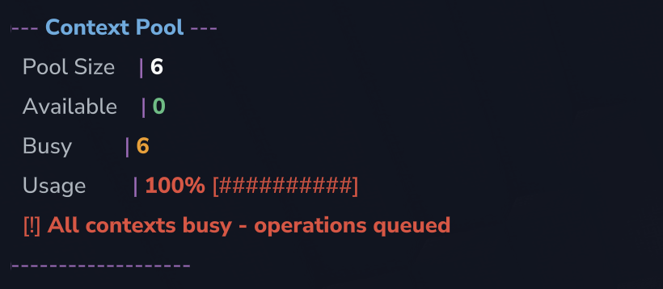
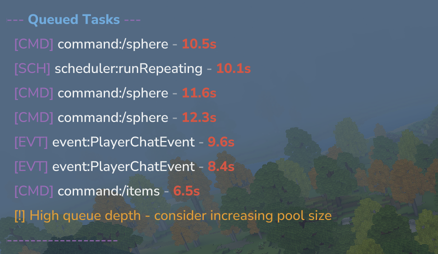

HytaleJS uses a context pool architecture to enable true concurrent JavaScript execution across multiple threads.

## Introduction & The Problem

**Concurrency in HytaleJS**

HytaleJS uses a **runtime pool architecture** to enable true concurrent JavaScript execution. Unlike traditional JavaScript runtimes (Node.js, browsers) that execute operations one at a time on a single thread, HytaleJS maintains a pool of independent V8 runtimes (via Javet) that can execute JavaScript in parallel across multiple threads.

**Why This Matters**

In a multiplayer Hytale server environment, events fire constantly - players chatting, breaking blocks, triggering interactions. Commands can perform expensive operations like building large structures. A traditional single-threaded JavaScript runtime would execute all operations sequentially, creating a bottleneck.

Consider this scenario:

- Player runs `/sphere 30` (creates ~3,700 blocks, takes ~10 seconds)
- In a single-threaded model: All other operations wait 10 seconds
- In HytaleJS's pool model: Other operations continue on separate threads

**The Trade-off**

Each context runs on its own thread and is isolated - JavaScript global variables are not shared between threads. However, Java objects (like `Universe`, `HytaleServer`) are passed by reference and can be safely accessed from any thread, since Java handles thread-safe object access.

## Architecture & How It Works

**The Runtime Pool**

HytaleJS creates a pool of N V8 runtimes at startup (default: 6, configurable via `config.json`). Each runtime executes independently.

```
    ┌────────┐ ┌───────┐ ┌───────┐
    │Runtime │ │Runtime│ │Runtime│  ... (6 total)
    │   1    │ │   2   │ │   3   │
    │ [BUSY] │ │[AVAIL]│ │[AVAIL]│
    └────────┘ └───────┘ └───────┘
         │
    /sphere 30
```

**Execution Flow**

When an operation needs to run JavaScript:

1. **Acquire**: Thread requests a runtime from the pool (blocking if all busy)
2. **Execute**: JavaScript code runs on that thread
3. **Release**: Runtime is returned to pool

**Example: Concurrent Operations**

```
Time    Runtime 1           Runtime 2           Runtime 3
────────────────────────────────────────────────────────
0ms     /sphere (acquire)   Available           Available
10ms    /sphere running...  Chat event (acq.)   Available
50ms    /sphere running...  Chat (complete)     /items (acquire)
100ms   /sphere running...  Available           /items (complete)
...
10s     /sphere (complete)  Available           Available
```

## Comparison with Node.js & Browser JavaScript

**Node.js & Browser: Single Event Loop**

Node.js and browser JavaScript use a single-threaded event loop model. All JavaScript code executes on one thread, processing tasks from a queue one at a time.

```
Node.js Event Loop:
┌─────────────────────────────┐
│   Event Queue               │
│  ┌─────────────────────┐    │
│  │ Task 1 (running)    │◄── Only one executes at a time
│  ├─────────────────────┤    │
│  │ Task 2 (waiting)    │    │
│  │ Task 3 (waiting)    │    │
│  │ Task 4 (waiting)    │    │
│  └─────────────────────┘    │
└─────────────────────────────┘
```

**Problem: Long Operations Block Everything**

When a long synchronous operation runs (e.g., a loop placing 3,700 blocks), the event loop is blocked. No other JavaScript can execute - not event handlers, not timers, not other requests.

**HytaleJS: Multi-Runtime Pool**

```
HytaleJS Runtime Pool:
┌─────────────────────────────┐
│   Runtime Pool              │
│  ┌─────────┐  ┌─────────┐   │
│  │ V8 1    │  │ V8 2    │   │◄── All execute in parallel
│  │/sphere  │  │ Chat    │   │
│  ├─────────┤  ├─────────┤   │
│  │ V8 3    │  │ V8 4    │   │
│  │ Event   │  │Available│   │
│  └─────────┘  └─────────┘   │
└─────────────────────────────┘
```

**Key Differences**

| Aspect              | Node.js/Browser         | HytaleJS                    |
| ------------------- | ----------------------- | --------------------------- |
| Execution threads   | 1                       | N (configurable, default 6) |
| Long operations     | Block everything        | Block 1/N contexts          |
| Concurrent requests | Queued sequentially     | Execute in parallel         |
| Shared state        | All code shares globals | Each context isolated       |

## Understanding Long Tasks

**What is a Long Task?**

A long task is any synchronous operation that holds a runtime for an extended period. While the operation runs, that runtime is unavailable for other operations.

**Common Long Task Patterns**

1. **Large Loops** - Building structures with nested iterations

The `/sphere` command creates a hollow sphere by iterating through a 3D volume to find blocks at the sphere's surface.

```typescript
for (let x = -radius; x <= radius; x++) {
  for (let y = -radius; y <= radius; y++) {
    for (let z = -radius; z <= radius; z++) {
      const dist = Math.sqrt(x * x + y * y + z * z);
      if (dist <= radius && dist >= radius - 1) {
        world.setBlock(centerX + x, centerY + y, centerZ + z, blockId);
      }
    }
  }
}
```

For radius 30: ~61³ = 226,981 iterations to find ~3,700 blocks to place.

2. **Heavy Computations** - CPU-intensive calculations that run synchronously

Mathematical operations or data processing that doesn't interact with the game world but takes significant CPU time.

```typescript
let result = 0;
for (let i = 0; i < 1000000; i++) {
  result += Math.sin(i) * Math.cos(i);
}
```

3. **Sequential World Operations** - Multiple expensive API calls in a loop

Reading or modifying many blocks in sequence without batching.

```typescript
for (let i = 0; i < 100; i++) {
  world.getBlockType(x, y + i, z);
  world.setBlock(x, y + i, z, blockId);
}
```

**What's NOT a Long Task**

- Scheduler callbacks (they release runtime between executions)
- Event handlers that complete quickly
- Commands with minimal logic

**Rule of Thumb**: If an operation takes >100ms, consider it a long task.

## Monitoring Commands

**`/hytalejs poolstats`** - View context pool statistics and current usage



**`/hytalejs runtime`** - Show runtime debug info (active runtime, pool size, multithreaded status)

**`/hytalejs tasks`** - Show operations waiting in queue



## Limitations & Pool Exhaustion

**When the Pool Gets Exhausted**

If all N runtimes are busy, new operations block until a runtime becomes available. This creates a queue.

**Example with Pool Size 4:**

```
Time    Available   Operation
0s      4          /sphere starts → 3 available
1s      3          Chat event → 2 available
2s      2          /items command → 1 available
3s      1          Another /sphere → 0 available
4s      0          Chat event → QUEUED (waits)
```

The queued operation waits until any running operation completes and releases its runtime.

**Runtime Isolation**

JavaScript global variables are NOT shared between runtimes:

```typescript
let counter = 0;

counter++;
```

Only Java objects passed through bindings (`Universe`, `HytaleServer`) are shared and thread-safe.

## Configuration

Runtime options can be configured via `config.json` in your plugin's data directory. The file is created automatically on first run:

```json
{
  "runtime": {
    "poolSize": 6,
    "multithreaded": true
  }
}
```

Set `multithreaded: false` to force single-threaded execution (pool size becomes 1).

```json
{
  "runtime": {
    "poolSize": 1,
    "multithreaded": false
  }
}
```

Edit the config and restart the server to apply changes.

## References

- [Javet Documentation](https://www.caoccao.com/Javet/)
- [Node.js Event Loop](https://nodejs.org/en/learn/asynchronous-work/event-loop-timers-and-nexttick)
- [Node.js: Don't Block the Event Loop](https://nodejs.org/en/learn/asynchronous-work/dont-block-the-event-loop)
